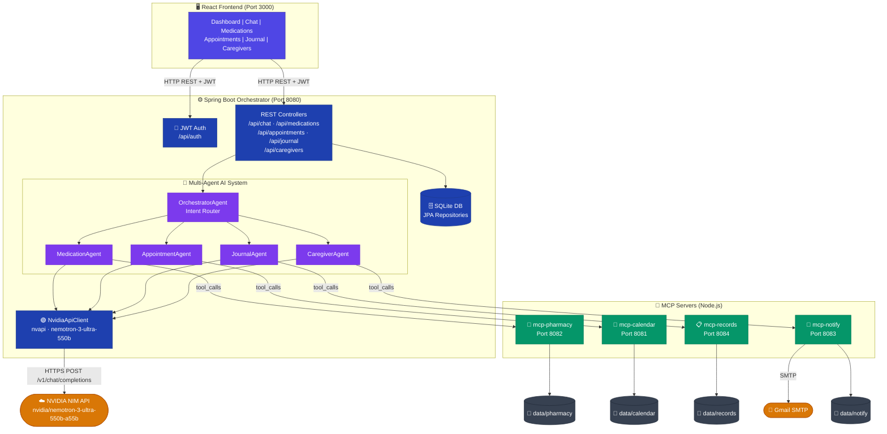

# 🏥 Health Concierge — AI-Powered Personal Health Management System

> A full-stack, multi-agent AI health management platform that helps patients track medications, appointments, vitals, and symptoms — powered by NVIDIA NIM API and built with Spring Boot microservices, MCP (Model Context Protocol) servers, and a React frontend.

---

## 📋 Table of Contents

- [Overview](#overview)
- [Features](#features)
- [Architecture](#architecture)
- [Tech Stack](#tech-stack)
- [Project Structure](#project-structure)
- [Prerequisites](#prerequisites)
- [Setup & Installation](#setup--installation)
- [Environment Variables](#environment-variables)
- [API Reference](#api-reference)
- [AI Agent System](#ai-agent-system)
- [MCP Servers](#mcp-servers)
- [Caregiver Access](#caregiver-access)
- [Contributing](#contributing)
- [License](#license)

---

## Overview

**Health Concierge** is a capstone project demonstrating an agentic AI architecture for personal health management. Patients can:

- Chat with an AI concierge that understands natural language health requests
- Manage medications with refill alerts and dose logging
- Book and track doctor appointments
- Log vitals (blood pressure, blood sugar, weight, heart rate, temperature) and symptoms
- Grant read-only access to caregivers (family members, nurses)

The AI backend uses the **NVIDIA NIM API** (`nvidia/nemotron-3-ultra-550b-a55b` model with extended thinking) through a multi-agent orchestration pattern. Each domain (medication, appointment, journal, caregiver) has its own specialist AI agent.

---

## Features

| Feature | Description |
|---------|-------------|
| 🤖 **AI Concierge Chat** | Natural language interface for all health actions |
| 💊 **Medication Management** | Add medications, log doses, get refill alerts |
| 📅 **Appointment Booking** | Schedule and view appointments with doctors |
| ❤️ **Health Journal** | Log vitals and symptoms, view history |
| 👥 **Caregiver Access** | Invite caregivers with read-only access via email |
| 📊 **Smart Dashboard** | Health score, activity feed, upcoming appointments at a glance |
| 📧 **Email Notifications** | Automated caregiver invite emails via Gmail SMTP |
| 🔐 **JWT Authentication** | Secure token-based login for patients and caregivers |

---

## Architecture



**Data Flow (Chat Request):**
1. User sends a message → React calls `POST /api/chat`
2. `OrchestratorAgent` classifies intent (`MEDICATION` / `APPOINTMENT` / `JOURNAL` / `CAREGIVER` / `GENERAL`)
3. Matching specialist agents are invoked — each calls the NVIDIA NIM API with a domain-specific system prompt
4. Agents return structured JSON `{ action, tool_calls, response_text }`
5. Orchestrator executes `tool_calls` against the relevant MCP servers
6. `mergeResponses` produces a single friendly natural-language reply
7. Response returned to the frontend

---

## Tech Stack

| Layer | Technology |
|-------|-----------|
| **Frontend** | React 18, Vite, React Router v6, Axios, Lucide Icons |
| **Backend** | Java 17, Spring Boot 3, Spring Security, Spring Data JPA |
| **Database** | SQLite (via Hibernate Community Dialect) |
| **AI Model** | NVIDIA NIM API — `nvidia/nemotron-3-ultra-550b-a55b` |
| **MCP Servers** | Node.js / Express (Calendar, Pharmacy, Notify, Records) |
| **Auth** | JWT (jjwt library), BCrypt password encoding |
| **Email** | Gmail SMTP via Spring Mail |
| **Containerization** | Docker + Docker Compose |
| **CSS** | Vanilla CSS with glassmorphism design system |

---

## Project Structure

```
health-management/
├── .env                          # Environment variables (not committed)
├── .env.example                  # Template for .env
├── .gitignore
├── docker-compose.yml            # All services
├── README.md
├── setup.sh                      # Linux/macOS setup script
├── setup.ps1                     # Windows setup script
│
├── frontend/                     # React application
│   ├── src/
│   │   ├── App.jsx               # Root layout + routing + sidebar
│   │   ├── index.css             # Global design system
│   │   ├── axiosConfig.js        # Axios base URL + JWT interceptor
│   │   └── pages/
│   │       ├── Dashboard.jsx     # Main dashboard with real data
│   │       ├── Chat.jsx          # AI concierge chat
│   │       ├── Medications.jsx   # Medication management
│   │       ├── Appointments.jsx  # Appointment management
│   │       ├── Journal.jsx       # Health journal (vitals + symptoms)
│   │       ├── Caregivers.jsx    # Caregiver management
│   │       ├── CaregiverDashboard.jsx  # Read-only caregiver view
│   │       ├── Login.jsx         # Login (patient + caregiver)
│   │       └── Register.jsx      # Patient registration
│   └── Dockerfile
│
├── orchestrator-service/          # Spring Boot backend
│   └── src/main/java/com/healthconcierge/orchestrator/
│       ├── agent/                 # AI specialist agents
│       │   ├── OrchestratorAgent.java
│       │   ├── MedicationAgent.java
│       │   ├── AppointmentAgent.java
│       │   ├── JournalAgent.java
│       │   └── CaregiverAgent.java
│       ├── client/
│       │   └── NvidiaApiClient.java  # NVIDIA NIM API client
│       ├── controller/            # REST endpoints
│       ├── model/                 # JPA entities
│       ├── repository/            # Spring Data repositories
│       ├── security/              # JWT filter + config
│       ├── service/               # Business logic
│       └── mcp/                   # MCP tool executors
│
├── mcp-calendar-server/           # Calendar MCP (Node.js)
├── mcp-pharmacy-server/           # Pharmacy/Medication MCP (Node.js)
├── mcp-notify-server/             # Notification/Email MCP (Node.js)
├── mcp-records-server/            # Health Records MCP (Node.js)
└── data/                          # Persistent data volumes (gitignored)
    ├── orchestrator/              # SQLite database
    ├── calendar/
    ├── pharmacy/
    ├── notify/
    └── records/
```

---

## Prerequisites

| Tool | Version | Install |
|------|---------|---------|
| **Docker** | 24+ | [docker.com](https://www.docker.com/get-started) |
| **Docker Compose** | 2.20+ | Included with Docker Desktop |
| **Node.js** (dev only) | 18+ | [nodejs.org](https://nodejs.org) |
| **Java** (dev only) | 17+ | [adoptium.net](https://adoptium.net) |
| **Git** | Any | [git-scm.com](https://git-scm.com) |

---

## Setup & Installation

### Option 1 — Automated Setup (Recommended)

**Windows (PowerShell):**
```powershell
git clone <your-repo-url> health-management
cd health-management
.\setup.ps1
```

**Linux / macOS (Bash):**
```bash
git clone <your-repo-url> health-management
cd health-management
chmod +x setup.sh
./setup.sh
```

Both scripts will:
1. Verify Docker is installed
2. Copy `.env.example` → `.env` (if not present)
3. Prompt for required secrets
4. Create data directories
5. Build and start all Docker services

---

### Option 2 — Manual Setup

**Step 1: Clone the repository**
```bash
git clone <your-repo-url> health-management
cd health-management
```

**Step 2: Create environment file**
```bash
cp .env.example .env
# Edit .env and fill in your values
```

**Step 3: Create data directories**
```bash
mkdir -p data/orchestrator data/calendar data/pharmacy data/notify data/records
```

**Step 4: Start all services**
```bash
docker compose up --build -d
```

**Step 5: Verify services are running**
```bash
docker compose ps
```

**Step 6: Access the application**

| Service | URL |
|---------|-----|
| 🌐 Frontend | http://localhost:3000 |
| ⚙️ Backend API | http://localhost:8080 |
| 📅 MCP Calendar | http://localhost:8081 |
| 💊 MCP Pharmacy | http://localhost:8082 |
| 📧 MCP Notify | http://localhost:8083 |
| 📋 MCP Records | http://localhost:8084 |

---

### Development Mode (without Docker)

**Backend (Spring Boot):**
```bash
cd orchestrator-service
# Set env vars locally first (or export them)
export NVIDIA_API_KEY=nvapi-...
export JWT_SECRET=your-secret
export MAIL_USERNAME=your@gmail.com
export MAIL_PASSWORD=your-app-password
./mvnw spring-boot:run
```

**Frontend (React):**
```bash
cd frontend
npm install
npm run dev
# Opens at http://localhost:5173
```

**MCP Servers:** (each in its own terminal)
```bash
cd mcp-calendar-server && npm install && npm start
cd mcp-pharmacy-server && npm install && npm start
cd mcp-notify-server && npm install && npm start
cd mcp-records-server && npm install && npm start
```

---

## Environment Variables

Copy `.env.example` to `.env` and fill in the values:

| Variable | Required | Description | Example |
|----------|----------|-------------|---------|
| `NVIDIA_API_KEY` | ✅ Yes | NVIDIA NIM API key from [build.nvidia.com](https://build.nvidia.com) | `nvapi-xxx...` |
| `JWT_SECRET` | ✅ Yes | Secret for signing JWT tokens (min 32 chars) | `my-super-secret-256-bit-key...` |
| `MAIL_USERNAME` | ✅ Yes | Gmail address for sending caregiver invites | `yourname@gmail.com` |
| `MAIL_PASSWORD` | ✅ Yes | Gmail App Password (not your login password) | `xxxx xxxx xxxx xxxx` |

> **Getting a Gmail App Password:**
> 1. Enable 2-Factor Authentication on your Google account
> 2. Go to Google Account → Security → App Passwords
> 3. Create a new app password for "Mail"
> 4. Use the 16-character code in `MAIL_PASSWORD`

> **Getting an NVIDIA API Key:**
> 1. Sign up at [build.nvidia.com](https://build.nvidia.com)
> 2. Go to your profile → API Keys → Generate Key
> 3. Copy the key starting with `nvapi-`

---

## API Reference

### Authentication
| Method | Endpoint | Description |
|--------|----------|-------------|
| `POST` | `/api/auth/register` | Register a new patient |
| `POST` | `/api/auth/login` | Patient login → returns JWT |
| `POST` | `/api/auth/caregiver-login` | Caregiver login → returns JWT |

### Chat (AI Concierge)
| Method | Endpoint | Description |
|--------|----------|-------------|
| `POST` | `/api/chat` | Send a message to the AI concierge |

**Request body:**
```json
{ "message": "Add ibuprofen 400mg twice daily" }
```

### Medications
| Method | Endpoint | Description |
|--------|----------|-------------|
| `GET` | `/api/medications` | List all medications |
| `POST` | `/api/medications` | Add a medication |
| `POST` | `/api/medications/{id}/log-dose` | Log a dose taken |
| `GET` | `/api/medications/refill-alerts` | Get low stock alerts |

### Appointments
| Method | Endpoint | Description |
|--------|----------|-------------|
| `GET` | `/api/appointments` | List all appointments |
| `POST` | `/api/appointments` | Create an appointment |

### Journal (Vitals & Symptoms)
| Method | Endpoint | Description |
|--------|----------|-------------|
| `GET` | `/api/journal?days=7` | Get health history (vitals + symptoms) |
| `POST` | `/api/journal/vitals` | Log a vital sign |
| `POST` | `/api/journal/symptoms` | Log a symptom |

### Caregivers
| Method | Endpoint | Description |
|--------|----------|-------------|
| `GET` | `/api/caregivers` | List caregivers for current patient |
| `POST` | `/api/caregivers/invite` | Invite a new caregiver by email |
| `DELETE` | `/api/caregivers/{id}` | Revoke caregiver access |

> All protected endpoints require `Authorization: Bearer <token>` header.

---

## AI Agent System

The AI system follows a **multi-agent orchestration pattern**:

```
User Message
     │
     ▼
OrchestratorAgent          ← classifies intent (MEDICATION, APPOINTMENT, JOURNAL, CAREGIVER, GENERAL)
     │
     ├── MedicationAgent   ← handles drug scheduling, dose logging, refill checks
     ├── AppointmentAgent  ← handles booking and pre-visit summaries
     ├── JournalAgent      ← handles vital logging and symptom tracking
     └── CaregiverAgent    ← handles caregiver notifications and alerts
           │
           ▼
     NvidiaApiClient       ← NVIDIA NIM API (nvidia/nemotron-3-ultra-550b-a55b)
           │
           ▼
     Tool Execution        ← MCP Server calls (calendar, pharmacy, records, notify)
           │
           ▼
     mergeResponses        ← Final natural language reply assembled
```

Each agent receives:
1. A **domain-specific system prompt** defining its tools, rules, and output format
2. A **context summary** of what the user wants

Each agent responds in structured JSON:
```json
{
  "action": "logging blood pressure vital",
  "tool_calls": [
    { "tool": "log_vitals", "params": { "type": "blood_pressure", "value": 120, "unit": "mmHg", "recorded_at": "2026-07-05T10:00:00" } }
  ],
  "response_text": "I've logged your blood pressure as 120 mmHg. That's within the normal range!"
}
```

---

## MCP Servers

[Model Context Protocol](https://modelcontextprotocol.io/) servers expose domain-specific tools:

| Server | Port | Tools |
|--------|------|-------|
| **mcp-calendar** | 8081 | `create_appointment`, `list_upcoming_appointments`, `get_pre_visit_summary` |
| **mcp-pharmacy** | 8082 | `add_medication`, `get_medication_schedule`, `log_dose_taken`, `check_drug_interactions`, `get_drug_info`, `get_refill_alerts` |
| **mcp-notify** | 8083 | `send_reminder`, `alert_caregiver`, `schedule_reminder` |
| **mcp-records** | 8084 | `log_vitals`, `log_symptom`, `get_health_history`, `get_trend_analysis` |

---

## Caregiver Access

Patients can invite caregivers (family members, home nurses) to view their health data in read-only mode:

1. Patient goes to **Caregivers** page → clicks **Invite Caregiver**
2. Enters caregiver's name and email
3. System generates a temporary password and sends it via email
4. Caregiver logs in at the login page (selects **Caregiver** toggle)
5. Caregiver sees a read-only view of: Appointments, Medications, Journal

> Caregivers cannot modify any data. They can only view.

---

## Contributing

1. Fork the repository
2. Create a feature branch: `git checkout -b feature/my-feature`
3. Commit your changes: `git commit -m "Add my feature"`
4. Push to the branch: `git push origin feature/my-feature`
5. Open a Pull Request

---

## License

This project is built as a **capstone academic project**. All rights reserved to the original authors.

---

## Troubleshooting

**Services won't start:**
```bash
docker compose logs orchestrator   # View backend logs
docker compose logs frontend       # View frontend logs
```

**NVIDIA API errors:**
- Verify your `NVIDIA_API_KEY` is valid at [build.nvidia.com](https://build.nvidia.com)
- Check that you have sufficient API credits

**Email not sending:**
- Ensure Gmail 2FA is enabled
- Use an App Password (not your regular Gmail password)
- Check `MAIL_USERNAME` and `MAIL_PASSWORD` in `.env`

**Database issues:**
```bash
docker compose down -v             # Remove volumes (WARNING: deletes all data)
docker compose up --build -d       # Fresh start
```
